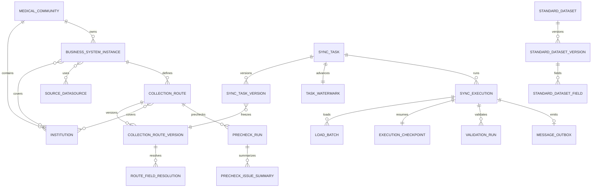

# P0 目标元数据模型

> 状态：阶段 1 设计完成，待 Review；尚未固化为 Flyway `V1`  
> 日期：2026-08-13  
> 适用范围：新系统独立 PostgreSQL 元数据库  
> 最终业务基线：`spec/PRODUCT_AND_BUSINESS_DECISIONS.md`

## 1. 设计结论

新系统不在当前 55 张老表上继续加字段，而是按“身份、不可变定义版本、可变运行态、不可变执行快照”四层重建 P0 模型。核心边界如下：

1. 业务系统实例与机构、源数据源分别多对多；采集链路属于实例和数据源，并维护覆盖机构集合。
2. 标准数据集只能同步导入。一次导入生成不可变数据集版本和字段定义；历史任务继续引用原版本。
3. 采集链路定义与链路版本分离。源对象、目标对象、数据集版本、字段解析结果及覆盖机构快照属于链路版本。
4. 同步任务身份与任务版本分离。任务唯一键是医共体、机构和数据集的未删除组合；调度、抽取、写入、校验和消息的执行配置固化在任务版本。
5. 正式水位属于长期任务运行态；恢复检查点属于某次执行。两者不再复用一个字段。
6. 载入批次保存确定性 Doris Label 和真实可用游标；没有业务主键时游标为空，不生成假检查点。
7. 预检运行只持久化运行记录和字段级/组合规则级汇总，不保存问题行、业务键明细、样例、严重级别或修复状态。
8. 阻断校验通过后，执行成功、正式水位推进和 outbox 事件在同一 PostgreSQL 事务内提交；消息投递失败不回滚同步成功。
9. 本文冻结逻辑模型、状态、约束和索引意图。列类型和名称可在 Review 中做无业务语义的规范化；Review 通过前不创建 `V1__baseline.sql`。

## 2. 全局数据库约定

| 项目 | 目标约定 |
| --- | --- |
| Schema | 所有业务表、Quartz 表和 Flyway history 位于新数据库的 `df_etl` Schema；连接默认 `search_path=df_etl,public`。 |
| 主键 | 元数据使用 `bigint GENERATED BY DEFAULT AS IDENTITY`；跨系统事件使用 `uuid`。不复制老库序列当前值。 |
| 时间 | 运行和审计时间统一 `timestamptz`；数据库写入 `CURRENT_TIMESTAMP`。业务窗口采用 `[lower, upper)`。 |
| 状态 | 使用受控 `varchar` 加 `CHECK`，便于后续 Flyway 扩展；不接受自由文本状态。 |
| JSON | 只用于不可变快照、方言相关游标、外部配置和可扩展统计；身份、关系、状态和高频过滤条件必须结构化。 |
| 删除 | 任务和采集链路使用 `deleted_at` 逻辑删除；运行历史、版本、水位、校验和审计不级联删除。 |
| 版本 | 版本表只插入不更新；`version_no` 在父对象内唯一，`contract_hash`/`definition_hash` 用于校验内容身份。 |
| 并发 | 业务唯一性和单任务/单链路活动运行由 PostgreSQL 唯一或部分唯一索引最终保证，应用事务只提供友好错误。 |
| 外键 | 配置和运行对象使用真实外键；密码、密钥只保存密文或外部 secret 引用，不写入 SQL 基础数据。 |

## 3. 目标关系总览



图中省略策略、审计、告警、外部 API 和 Quartz 支撑表；它们不改变核心所有权关系。

## 4. 租户、机构、实例和数据源

### 4.1 主表和关系表

| 表 | 关键字段 | 约束和说明 |
| --- | --- | --- |
| `medical_community` | `id`, `code`, `name`, `status`, audit columns | 当前业务租户边界；`lower(code)` 唯一。虽然现有部署可能只有一个医共体，也必须显式建模，因为任务唯一键包含 `community_id`。 |
| `institution` | `id`, `community_id`, `code`, `name`, `type`, `parent_id`, `status`, audit columns | `code` 全局大小写不敏感唯一；`(id, community_id)` 额外唯一，供跨表复合外键保证同一医共体。 |
| `business_system_instance` | `id`, `community_id`, `code`, `name`, `system_type`, `vendor`, `product_version`, `status`, `description`, audit columns | `(community_id, lower(code))` 唯一；不以厂商或单机构作为唯一边界。 |
| `source_datasource` | `id`, `code`, `name`, `db_type`, host/database/schema/credential fields, JDBC/pool/timeouts, `status`, audit columns | 不再有 `institution_id`、`group_id` 或可调 Reader 并发；连接秘密保存密文/secret 引用。`lower(code)` 唯一。 |
| `target_datasource` | `id`, `code`, `name`, Doris FE/HTTP/Stream Load/database/credential/pool/batch fields, `ssl_enabled`, `status`, audit columns | 明确承载产品要求的 Doris 参数；`lower(code)` 唯一。 |
| `business_system_instance_institution` | `community_id`, `instance_id`, `institution_id`, audit columns | 主键 `(instance_id, institution_id)`；复合外键保证实例和机构属于同一医共体。 |
| `business_system_instance_datasource` | `instance_id`, `source_datasource_id`, `purpose`, `priority`, audit columns | 主键 `(instance_id, source_datasource_id)`；同一数据源可以服务多个真实实例。 |

### 4.2 索引

- `institution(community_id, status, id)` 支撑租户内机构列表；`institution(parent_id)` 支撑层级查询。
- 两张实例关联表均建立反向索引：`(institution_id, instance_id)` 和 `(source_datasource_id, instance_id)`。
- 数据源列表以 `(status, id)` 和大小写不敏感 code 唯一索引为主，不再以单个 `institution_id` 查询。

## 5. 标准数据集、字段合同和 Doris 用途

### 5.1 数据集身份与不可变版本

| 表 | 关键字段 | 约束和说明 |
| --- | --- | --- |
| `standard_dataset` | `id`, `external_dataset_id`, `dataset_code`, `name`, `status`, `current_version_id`, `first_imported_at`, `last_synced_at`, audit columns | 数据集身份可更新展示信息但不可手工创建；`lower(dataset_code)` 和 `external_dataset_id` 分别唯一。 |
| `standard_dataset_version` | `id`, `dataset_id`, `version_no`, `source_definition_version`, `definition_hash`, `conversion_contract_version`, `institution_code_field_code`, `incremental_field_code`, `field_count`, `imported_at`, `imported_by` | 只插入；`(dataset_id, version_no)`、`(dataset_id, definition_hash)` 唯一。当前版本指针只能指向本数据集版本。 |
| `standard_dataset_field` | `id`, `dataset_version_id`, `external_field_id`, `field_code`, `field_name`, `ordinal_no`, standard type/format/length/precision/scale, `nullable`, `business_key_ordinal`, value-domain/format contract, `doris_type`, `doris_nullable` | `(dataset_version_id, lower(field_code))` 和 `(dataset_version_id, ordinal_no)` 唯一；联合业务主键顺序由非空 `business_key_ordinal` 表达，不使用技术字段替代。 |
| `field_conversion_contract` | `contract_version`, medical type/format selector, Doris type template, normalization/checksum protocol, `status`, audit columns | 显式、版本化的医疗字段转换合同；与通用 JDBC→Doris 类型映射分开。已被数据集版本引用的合同不可原地修改。 |
| `generic_jdbc_type_mapping` | db type/JDBC selector, Doris suggestion, `priority`, `enabled`, audit columns | 只用于非标准或诊断场景，不得覆盖标准医疗字段合同。 |

### 5.2 数据集治理策略

| 表 | 目标职责 |
| --- | --- |
| `dataset_sync_policy` | 数据集级调度、fetch size、时间上界延迟、回看窗口等默认值；含 `revision` 和乐观锁。Reader 并发不提供可编辑字段，执行合同固定为 1。 |
| `dataset_validation_policy` | 数据集级 `ROW_COUNT`/`ROW_COUNT_CHECKSUM`、容差、是否同步后阻断校验等覆盖；默认 `ROW_COUNT`、容差 0、`lookback_hours=0`、自动复检关闭。 |
| `dataset_message_policy` | 数据集级消息启用、来源系统、租户、routing key、topic、messageKey 模板、首次全量模式、限速和分页大小。默认关闭。 |

策略表是可变治理配置而不是执行历史。每次生成任务版本时保存版本级有效策略；每次执行还保存最终有效策略快照，防止运行中配置漂移。

### 5.3 Doris 表用途注册

`doris_table_contract` 记录 `dataset_version_id`、`purpose`（`ODS`/`RAW`）、目标数据源/数据库/表名、DDL 合同版本、结构哈希、创建/核对时间和状态。

- `(dataset_version_id, purpose, target_datasource_id)` 唯一。
- `purpose` 创建后不可切换；ODS 和 RAW 不能相互转换。
- ODS 业务列严格按数据集版本；RAW 业务列全部字符串且允许 `NULL`，并包含预检运行和链路隔离列。
- PostgreSQL 只保存用途和结构合同，不保存 Doris 原始预检行。

## 6. 采集链路和字段解析快照

### 6.1 链路身份与覆盖机构

| 表 | 关键字段 | 约束和说明 |
| --- | --- | --- |
| `collection_route` | `id`, `community_id`, `dataset_id`, `business_system_instance_id`, `source_datasource_id`, `source_schema`, `source_object`, `source_object_type`, `target_datasource_id`, `target_table`, `status`, `current_version_id`, `deleted_at`, audit columns | 链路本身不保存运行状态或最近同步。源对象类型仅 `TABLE/VIEW/MATERIALIZED_VIEW`；无 `CUSTOM_SQL`。 |
| `collection_route_institution` | `route_id`, `business_system_instance_id`, `institution_id`, audit columns | 当前覆盖集合；主键 `(route_id, institution_id)`。复合外键同时保证该机构属于链路的系统实例覆盖范围。 |
| `collection_route_version` | `id`, `route_id`, `version_no`, `dataset_version_id`, instance/source/target/object snapshot, `source_structure_hash`, `resolution_status`, `resolution_error`, `contract_hash`, `created_by`, `created_at` | 只插入；`(route_id, version_no)` 和 `(route_id, contract_hash)` 唯一。链路变更、数据集版本变更或重新解析都会产生新版本。 |
| `collection_route_version_institution` | `route_version_id`, `institution_id`, `institution_code` | 固化该版本覆盖机构和当时机构编码；主键 `(route_version_id, institution_id)`。 |

未删除链路按以下业务键唯一：

```text
(business_system_instance_id, source_datasource_id, dataset_id,
 lower(coalesce(source_schema, '')), lower(source_object))
WHERE deleted_at IS NULL
```

`source_schema` 对不支持 Schema 的源库可空；表达式唯一索引避免 PostgreSQL 的 `NULL` 产生重复链路。删除链路前必须确认不存在未删除任务引用。

### 6.2 标准字段到 JDBC 真实字段名的只读快照

`route_field_resolution` 字段：

- `route_version_id`, `dataset_field_id`, `standard_field_code`, `standard_ordinal_no`；
- `jdbc_field_name`, `jdbc_type_code`, `jdbc_type_name`, `jdbc_nullable`, `jdbc_ordinal_no`；
- `doris_field_name`（固定为标准字段小写）、`conversion_contract_version`；
- `match_status`（`MATCHED/MISSING/AMBIGUOUS/EXTRA/TYPE_UNSUPPORTED`）和只读诊断。

约束和索引：

- `(route_version_id, lower(standard_field_code))` 唯一；已匹配行的 `(route_version_id, lower(jdbc_field_name))` 唯一。
- 不保存 alias、默认值、转换表达式或人工重命名字段。
- 额外源字段用同一快照中的诊断行或结构诊断 JSON 表达，但不能被 Reader 静默忽略。
- Reader、机构过滤、时间窗口、预检和 Checksum 只能引用任务版本关联的这份快照。

`resolution_status` 可显示风险但不是创建/运行的数据库门禁；正式执行前解析不完整时明确失败。

## 7. 同步任务身份、版本和治理覆盖

### 7.1 任务身份

| 表 | 关键字段 | 约束和说明 |
| --- | --- | --- |
| `sync_task` | `id`, `community_id`, `institution_id`, `dataset_id`, `route_id`, `name`, `lifecycle_status`, `current_version_id`, `schedule_blocked`, `block_reason`, `catch_up_pending`, `deleted_at`, audit columns | 只保存长期身份和小量运行控制状态；不放 Cron、字段映射、窗口或正式水位。 |
| `sync_task_version` | `id`, `task_id`, `version_no`, `route_version_id`, `dataset_version_id`, `task_kind`, `write_mode`, `doris_key_model`, institution code snapshot, incremental/upper/lookback/fetch/schedule config, validation/message effective config, field contract hash, `status`, `created_by`, `created_at` | 只插入；`(task_id, version_no)`、`(task_id, contract_hash)` 唯一。任务执行必须引用明确版本。 |
| `task_governance_override` | `task_id`, nullable validation/message/scheduling overrides, `revision`, audit columns | 表达任务级覆盖；生成任务版本时计算全局→数据集→任务最终值。 |

未删除任务的数据库最终唯一性：

```sql
CREATE UNIQUE INDEX ...
ON sync_task (community_id, institution_id, dataset_id)
WHERE deleted_at IS NULL;
```

草稿、启用、暂停、失败和停用均占用该唯一键。任务对 `(route_id, institution_id)` 建复合外键，保证所选机构在链路覆盖集合内；同时以复合约束保证任务 `dataset_id` 与链路一致。运行中的任务由服务层拒绝逻辑删除，历史版本和运行对象使用 `RESTRICT` 外键。

### 7.2 受控状态与任务种类

`sync_task.lifecycle_status`：

- `DRAFT`：已创建但未启用调度；
- `ENABLED`：允许人工和调度触发；
- `PAUSED`：人工暂停；
- `FAILED`：最近执行失败且调度被阻断；
- `DISABLED`：停用但仍占唯一关系。

`sync_task_version.status` 仅 `DRAFT/PUBLISHED/SUPERSEDED`。发布新版本以事务切换 `current_version_id`，不能更新历史版本。

`task_kind`/`write_mode` 只允许业务基线的三种组合：

| 数据集合同 | `task_kind` | `write_mode` | 关键约束 |
| --- | --- | --- | --- |
| 无业务主键 | `FULL_ONLY` | `REPLACE_INSTITUTION_SCOPE` | 单 Reader 流式全量；清理当前机构范围；无假游标。 |
| 有业务主键和 `XIUGAISJ` | `FULL_THEN_INCREMENTAL` | `UPSERT` | 首次全量开始时间为初始水位，成功后立即追赶；增量 `[watermark, upper)`。 |
| 有业务主键、无有效增量字段 | `FULL_ONLY` | `UPSERT` | 每次当前机构全量 UPSERT。 |

以下字段不进入目标任务版本：`CUSTOM_SQL`、任意 static/per-table filter、`ID_RANGE`、`split_pk` 作为业务键、自动重试参数、可调 Reader 并发、脏数据分流、STRICT/PERMISSIVE 切换。

## 8. 执行、载入批次、恢复检查点和正式水位

### 8.1 执行模型

| 表 | 关键字段 | 约束和说明 |
| --- | --- | --- |
| `sync_execution` | `id`, `execution_uuid`, `task_id`, `task_version_id`, `operation_type`, `retry_of_execution_id`, `recollect_of_execution_id`, `status`, trigger/schedule snapshot, fixed window, effective config JSON, counts/metrics, engine job id, error, timestamps | `execution_uuid` 全局唯一。补采为独立运行，窗口显式记录且不改正式水位。 |
| `load_batch` | `id`, `execution_id`, `batch_no`, `status`, cursor lower/upper JSON, time lower/upper, institution code/range, row counts, payload checksum, `doris_label`, Doris txn/status/probe fields, error, timestamps | `(execution_id, batch_no)` 和 `doris_label` 唯一；Label 可由执行 UUID 和批次号确定性推导。 |
| `execution_checkpoint` | `execution_id`, `last_committed_batch_id`, `cursor_json`, `checkpoint_kind`, `committed_at`, `revision` | 每个执行最多一行，仅在 Doris 已确认提交后推进；无业务主键全量的 `checkpoint_kind=NONE`，游标为空。 |
| `task_watermark` | `task_id`, `watermark_value`, `last_success_execution_id`, `revision`, `updated_at` | 每个未删除任务一行；只在完整执行和阻断校验通过后推进。 |
| `task_watermark_history` | `id`, `task_id`, `execution_id`, `before_value`, `after_value`, `reason`, `operator`, `created_at` | `execution_id` 唯一；重置水位需要权限、确认和审计。补采不插入推进记录。 |
| `execution_reconciliation` | `id`, `execution_id`, `load_batch_id`, probe result, final decision, operator/note/timestamps | Doris 返回不明确时记录 Label/事务探测和人工处置；未明确前禁止盲目重发。 |

### 8.2 状态和并发约束

`sync_execution.status`：

```text
PENDING -> RUNNING -> LOADING -> VALIDATING -> SUCCEEDED
                         |            |
                         +----------> FAILED
                         +----------> CANCELLED
                         +----------> RECONCILE_REQUIRED
```

- 失败、取消和待核对均不推进正式水位并阻断调度。
- 不存在 `SUCCESS_WITH_DIRTY_ROWS`，因为正式 ODS 不接受跳过问题行。
- 人工重试新建执行并指向 `retry_of_execution_id`，复用原执行最后已确认检查点；不在原行上增加 `retry_count` 自动循环。
- 重新采集和补采分别使用 `RECOLLECT/BACKFILL` 操作类型；只有明确的清空重建命令可清理范围。
- 任务的活动执行建立部分唯一索引：`task_id WHERE status IN ('PENDING','RUNNING','LOADING','VALIDATING','RECONCILE_REQUIRED')`。
- 调度触发遇到活动执行时只以 `sync_task.catch_up_pending=true` 合并一次；成功后消费一次，失败后保留阻断而不自动启动。
- `load_batch(execution_id, status, batch_no)`、`sync_execution(task_id, created_at DESC)` 和所有父外键列建立查询索引。

### 8.3 原子完成边界

一次普通/追赶/人工重试执行完成时使用一个短 PostgreSQL 事务：

1. 锁定 `sync_execution` 和 `task_watermark`；
2. 确认全部载入批次已提交且最终阻断 `validation_run` 通过；
3. 把执行改为 `SUCCEEDED`；
4. 推进 `task_watermark` 并写入 history（空窗口也推进）；
5. 如有效消息策略开启，插入唯一 `message_outbox`；
6. 提交后由独立发布器发送消息。

该事务不包含 Doris 或 MQ 网络调用。

## 9. 数据预检运行和问题汇总

| 表 | 关键字段 | 约束和说明 |
| --- | --- | --- |
| `precheck_run` | `id`, `run_uuid`, `route_id`, `route_version_id`, optional `institution_id`, `execution_status`, `result_status`, structure/resolution snapshot hashes, phase/progress, extracted/checked/issue row counts, raw retention deadline/cleaned time, error, trigger/operator/timestamps | 人工发起；重新预检新建行。`result_status` 只在完成时为 `PASS/ISSUES`。 |
| `precheck_issue_summary` | `id`, `run_id`, optional `institution_id`, `rule_scope`, optional `standard_field_code`, `rule_code`, `rule_definition_version`, `affected_rows`, `observed_metrics` JSON, `summary`, timestamps | 只保存字段级和组合规则级聚合；不含业务键、原始行、样例、severity、处理/修复状态。 |
| `precheck_export_job` | `id`, `run_id`, export format/status, storage reference, expiry, requester/timestamps, error | 导出同样只包含汇总；文件到期清理。 |

`execution_status` 固定：`PENDING/EXTRACTING/VALIDATING/COMPLETED/FAILED/CANCELLED`；`result_status` 固定：`PASS/ISSUES`。完整扫描发现不合格数据是 `COMPLETED + ISSUES`，不是技术失败。

并发和索引：

- `route_id WHERE execution_status IN ('PENDING','EXTRACTING','VALIDATING')` 部分唯一，保证同链路只有一个活动预检。
- 全局并发上限由系统设置和加锁队列控制；不同链路可以并发。
- 索引 `precheck_run(route_id, created_at DESC)`、`precheck_run(institution_id, created_at DESC)`、`precheck_issue_summary(run_id, institution_id, standard_field_code)`。
- RAW 数据由 Doris 的 `precheck_run_id + route_id` 隔离，终态后保留 1 天；PostgreSQL 只记录清理截止时间和结果。

预检运行不被任何任务创建/运行外键作为准入条件。界面可查询最新结果并展示风险，但不存在 `validation_status=PASSED` 才允许启用链路的约束。

## 10. 校验策略和校验运行

### 10.1 策略层级

`global_validation_policy` 提供系统默认；`dataset_validation_policy` 和 `task_governance_override` 只保存覆盖值。生成任务版本和开始执行时分别固化最终值，优先级为：

```text
全局默认 < 数据集覆盖 < 任务覆盖
```

数据库/服务校验规则：

- 默认 `ROW_COUNT`、容差 0、`lookback_hours=0`、自动复检关闭。
- 只有数据集版本有真实联合业务主键时才允许 `ROW_COUNT_CHECKSUM`。
- 不允许性能原因、数据量或缺少比对键时静默降级。
- `splitPk`、机构码和 `_etl_*` 字段不能充当业务主键或 Checksum 字段。

### 10.2 运行和分片

| 表 | 关键字段 | 约束和说明 |
| --- | --- | --- |
| `validation_run` | `id`, `run_uuid`, optional `execution_id`, `task_id`, `task_version_id`, `validation_type`, `trigger_type`, `status`, `result`, policy/range/protocol snapshot, source/target counts and checksum, `recheck_of_run_id`, error, timestamps | 同步门禁、人工复检、全量治理和删除对账均新建独立运行。`(execution_id, validation_type)` 对非空执行唯一。 |
| `validation_run_segment` | `id`, `validation_run_id`, `segment_no`, business-key/time range JSON, source/target count/checksum, `status`, error, timestamps | `(validation_run_id, segment_no)` 唯一；用于大表分段和可审计汇总。 |
| `validation_difference_summary` | `id`, `validation_run_id`, `difference_type`, optional field code, affected rows, metrics JSON | 为详情和导出提供聚合，不把预检的禁行级规则错误套到校验模型。若未来保存逐行业务差异，必须单独评审容量、保留期和权限。 |
| `validation_export_job` | run, format/status, storage reference/expiry/requester/timestamps | 导出异步生成并审计。 |

`validation_run.status`：`PENDING/RUNNING/COMPLETED/FAILED/CANCELLED`；`result`：`PASS/MISMATCH`。校验异常是 `FAILED`，数据不一致是 `COMPLETED + MISMATCH`，两者都阻止同步执行成功。

索引：`validation_run(task_id, created_at DESC)`、`validation_run(execution_id)`、`validation_run(status, created_at)`、`validation_run_segment(validation_run_id, status, segment_no)`。

## 11. 消息事务发件箱

| 表 | 关键字段 | 约束和说明 |
| --- | --- | --- |
| `message_outbox` | `id`, `event_id` UUID, `execution_id`, `event_type`, payload/headers JSON, routing/topic/message key snapshot, `status`, `available_at`, `attempt_count`, `next_attempt_at`, `published_at`, last error, timestamps | `event_id` 和 `(execution_id, event_type)` 唯一。只在执行成功和水位推进事务中插入。 |
| `message_delivery_attempt` | `id`, `outbox_id`, `attempt_no`, provider/message id, request/result snapshot, `status`, started/finished, error | `(outbox_id, attempt_no)` 唯一；用于投递审计和人工重发。 |

`message_outbox.status`：`PENDING/PUBLISHING/PUBLISHED/FAILED/DEAD_LETTER`。发布器通过 `FOR UPDATE SKIP LOCKED` 抢占 `(status, available_at)` 索引中的待发事件。发送失败只改变 outbox，不改变 `sync_execution=SUCCEEDED` 或正式水位。人工重发沿用同一 `event_id`，由下游幂等消费。

## 12. P0 支撑对象

以下老系统能力仍是新服务启动或产品交付所需，但不改变核心领域边界；`V1` 设计时应按当前真实查询逐表核对：

- `app_user`、角色/权限关联和 `audit_log`；禁止 SQL 写入固定管理员密码。
- `system_setting`；需要为 key 建唯一/主键，并对已知设置值做类型和范围校验。
- `alert_channel`、`alert_rule`、`alert_event`、`alert_delivery`；移除重复的 channel/webhook 表达。
- 外部 API client、授权范围、请求日志、幂等请求和限流状态；任务 API 必须调用新领域服务，不能直接写表。
- Quartz JDBC JobStore 表；使用独立新库和新 scheduler identity，不迁移老 Quartz 运行态。

这些表与执行历史同样不从老库整体恢复；最终配置迁移范围由 `DB-002` 决定。

## 13. 当前实体、Repository、查询路径差异清单

### 13.1 字段与关系差异

| 范围 | 当前代码/老库 | 目标差异 | 实施影响 |
| --- | --- | --- | --- |
| 医共体 | 没有显式 `medical_community`；任务唯一性只在应用按机构/数据集扫描。 | 新增租户根和任务部分唯一索引。 | API 上下文、机构和任务创建都必须携带/解析 `community_id`。 |
| 源数据源 | `SourceDataSource.institutionId` 单归属；`findByInstitutionId`/`countByInstitutionId` 广泛使用。 | 数据源与实例多对多，机构通过实例覆盖关系得到。 | 替换 `SourceDataSourceRepository`、机构统计和创建时继承机构的查询路径。 |
| 系统实例 | 当前无实体、Repository 和外键。 | 新增实例及两张多对多表。 | 新建管理 API/服务；链路创建先验证实例覆盖和数据源关系。 |
| 链路 | `InstitutionDatasetRoute` 直接含单个 `institutionId`，并保存 `enabled`、结构 `validationStatus` 和当前 revision。 | 链路多机构；身份/版本/覆盖快照分离；链路无运行态，预检不作准入。 | 重写 route repository/resolver/validation service；删除 `enabled` 依赖结构通过的门禁。 |
| 字段映射 | `TaskViewConfig.fieldMappings` JSON 可编辑；任务控制器直接返回它。 | 只读 `route_field_resolution`，只允许大小写解析。 | 删除字段重命名写入口；所有 SQL 生成统一使用解析快照。 |
| 数据集 | `DfetlDataset`/`DfetlField` 只代表当前行，历史脚本一度删除 definition version。 | 数据集身份、不可变版本、字段版本和合同版本。 | 导入改为 append version + 原子切 current；任务引用明确版本。 |
| 任务 | `SyncTask` 是大型扁平实体，混放定义、调度、运行状态、水位、JSON 映射、过滤、重试和已废止模式。 | `sync_task` 身份 + `sync_task_version` + governance override + runtime state。 | 所有创建/修改改为发布新版本；移除 `CUSTOM_SQL/ID_RANGE/自动重试/问题分流`。 |
| 执行 | `TaskExecution` 不引用任务版本，快照仅覆盖少数字段，并含 `SUCCESS_WITH_DIRTY_ROWS`。 | 执行引用不可变任务版本并保存最终有效配置；移除分流成功状态。 | 执行组装器和监控 DTO 按版本/执行快照读取。 |
| 水位 | `SyncTask.incrementalCheckpoint` 同时被当作展示、窗口起点和水位；首次全量标志也在任务行。 | `task_watermark`/history 与 `execution_checkpoint` 分离。 | `WatermarkService` 改为带行锁和版本的独立事务边界；监控不再读任务配置字段。 |
| 批次 | 现有 chunk/range 多为文本，Label 和游标约束不完整。 | 每批保存确定性 Label、真实业务键/时间/机构范围和 Doris 最终状态。 | Writer 以批次为幂等单元；无业务键时 checkpoint 明确为空。 |
| 预检 | `DfetlPrecheckRun` 混合状态；issue/dirty 表保存问题行、severity、主键和处理状态。 | 运行状态与结果分开，仅保存字段/组合规则汇总。 | 删除 dirty/issue 行查询与修复 API；工作台改查 summary。 |
| 校验 | `TaskValidationConfig`、`DfetlValidationPolicy`、`ValidationRun` 和 `etl_verify_*` 并存；`legacy_exec_id` 暴露旧身份。 | 全局/数据集/任务三层策略和统一 run/segment；执行 ID 为正式关系。 | 合并策略解析器和运行查询；去除 legacy identity。 |
| 消息 | `DfetlMessagePolicy`、`MessagePublishConfig`、publish log、send record 分散；成功后补写，非事务 outbox。 | 数据集默认/任务覆盖 + 执行快照 + outbox/attempt。 | 完成事务插入事件，独立发布器消费；旧 recovery/log 扫描退出。 |
| 已移除功能 | 实体仍含 batch template、dirty row/field、task group 痕迹和 auto retry 配置。 | 不进入新 `V1`。 | Java 实体、Repository、Controller 和不可达页面在对应实现阶段删除。 |

### 13.2 状态差异

| 当前状态/默认 | 问题 | 目标 |
| --- | --- | --- |
| `SUCCESS_WITH_DIRTY_ROWS` | 表示跳过/分流问题数据后仍成功。 | 删除；正式执行要么完整通过，要么失败/取消/待核对。 |
| route `PENDING/PASSED/FAILED` + `enabled` | 把结构检查当准入门禁。 | 结构诊断进入预检；链路只有配置生命周期，不阻断任务创建。 |
| precheck 一个 `status` | 无法区分技术失败与检查出问题。 | `execution_status` 与 `result_status` 分开。 |
| validation 默认 lookback 24/自动复检 | 扩大本批范围且会自动重复执行。 | 默认 lookback 0，自动复检关闭，人工复检新建运行。 |
| task auto retry/retry count | 与人工处理基线冲突。 | 执行失败阻断；人工重试新建关联执行。 |
| `ID_RANGE`/`CUSTOM_WINDOW` 混入普通任务 | 与标准医疗时间增量和补采边界混淆。 | 标准增量只用 `XIUGAISJ`；历史范围使用独立 `BACKFILL` 执行。 |

### 13.3 约束差异

| 必须新增/替换的数据库约束 | 当前缺口 |
| --- | --- |
| 未删除任务 `(community_id, institution_id, dataset_id)` 部分唯一 | 当前由 `SyncTaskApplicationService` 先查询后判断，存在并发竞态，且缺 `community_id/deleted_at`。 |
| 未删除链路的实例/数据源/数据集/源对象表达式唯一 | 当前核心唯一关系偏向 `(institution_id,dataset_id)`，无法共享链路。 |
| 任务机构必须属于链路覆盖集合 | 当前依赖 resolver/service 手工比对单机构和数据源归属。 |
| 版本父对象内 `version_no`/hash 唯一且不可更新 | 当前 `SyncTask.version`、route revision 和字段当前行可原地覆盖。 |
| 同任务一个活动执行、同链路一个活动预检 | 当前主要靠查询/内存或调度控制，不能抵抗多节点并发。 |
| 每执行/类型一个门禁校验 | 当前围绕 `task_id + legacy_exec_id` 的兼容唯一键。 |
| `execution_id + batch_no` 和 Doris Label 唯一 | 当前 Label 幂等身份未成为统一数据库约束。 |
| `execution_id + event_type`/event UUID 唯一 | 当前消息日志和发送记录不能保证成功事务只产生一个事件。 |
| 枚举 CHECK、非负计数、窗口 `lower < upper`、合理策略组合 | 当前大量状态和模式为无约束 String，错误组合可直接持久化。 |

### 13.4 查询和索引差异

| 当前查询路径 | 目标查询/索引 |
| --- | --- |
| `SourceDataSourceRepository.findByInstitutionId/countByInstitutionId` | 经实例覆盖表联接；反向索引从 institution→instance→datasource，统计使用去重 datasource ID。 |
| `InstitutionDatasetRouteService.list` 读取全部后在 Java 过滤 | Repository 按 `dataset_id/instance_id/covered institution/deleted_at` 分页查询，对外键和关联表建组合索引。 |
| `InstitutionDatasetRouteResolver` 检查 route.institution 与 datasource.institution | 通过复合外键保证覆盖关系，resolver 读取明确 route version 和 resolution snapshot。 |
| `SyncTaskApplicationService.findExistingTaskId` 扫机构任务再比 dataset | 直接按部分唯一键查询；创建依赖唯一冲突处理，不先扫列表。 |
| `SyncTaskRepository` 含修复空机构和数据源归属的 JPQL | 新库无历史脏数据修复查询；配置迁移由 `DB-002` 工具显式完成。 |
| `WatermarkService` 更新任务行 checkpoint | 锁 `task_watermark(task_id)`；执行详情按 `sync_execution` 和 `execution_checkpoint` 查询。 |
| 预检 issue/dirty 行分页 | 按 run/institution/field/rule 查询 summary；不再提供行级索引。 |
| publish log/recovery 定时扫描 | outbox 使用 `(status, available_at)` 索引和 `SKIP LOCKED`。 |

## 14. 目标模型到现有对象的处置映射

| 现有对象组 | 处置 |
| --- | --- |
| `institution`, `source_datasource`, `target_datasource` | 保留概念，按本模型重建字段和关系。 |
| `dfetl_dataset`, `dfetl_field` | 由 `standard_dataset*` 版本模型替代。 |
| `institution_dataset_route` | 由 `collection_route*` 和覆盖/解析快照替代。 |
| `sync_task`, `task_view_config` | 由任务身份/版本/治理覆盖替代；字段映射不再可编辑。 |
| `task_execution`, task chunk/batch/checkpoint fields | 由 execution/load batch/checkpoint/watermark 体系替代。 |
| `dfetl_precheck_*`, `medical_dirty_*`, `dirty_record` | 只保留 run/summary/export；行级和修复模型废止。 |
| `validation_run`, `etl_verify_*`, validation configs | 合并为分层策略和统一 validation run/segment/summary。 |
| message policy/config/log/send record | 合并为策略、执行快照、outbox 和 attempt。 |
| `validation_task`, `dfetl_task`, `task_group`, batch template | 新 `V1` 不创建。 |

## 15. Review 门槛与后续步骤

阶段 1 的设计产物已覆盖 P0 表、关系、状态、唯一约束、版本边界和关键索引。进入阶段 2 前必须 Review 确认本文；Review 前：

- 不创建、命名或提交 `server/src/main/resources/db/migration/V1__baseline.sql`；
- 不移动历史 SQL，避免把“归档位置调整”误当成已建立 Flyway 链；
- 不修改当前实体去适配尚未 Review 的物理表名；
- 不连接、修改或 Flyway baseline 老 `df_ygt/df_etl` 数据库。

Review 通过后，阶段 2 应一次完成：物理 DDL、Flyway/配置、legacy 隔离、实体和 Repository 对齐、迁移前检查、迁移后验证、失败回退/前向修复说明，以及独立空 PostgreSQL 的 `migrate/validate` 和真实启动验证。
