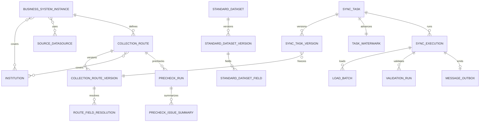

# P0 目标元数据模型

> 状态：阶段 1 目标模型 Review 进行中；本轮确认项已合并；尚未固化为 Flyway `V1`  
> 日期：2026-08-14  
> 适用范围：新系统独立 PostgreSQL 元数据库  
> 最终业务基线：`spec/PRODUCT_AND_BUSINESS_DECISIONS.md`

## 1. 设计结论

新系统不在当前 55 张老表上继续加字段，而是按“身份、不可变定义版本、可变运行态、不可变执行快照”四层重建 P0 模型。核心边界如下：

1. 一个部署及其独立 PostgreSQL 元数据库只服务一个医共体；医共体名称和编码属于系统设置，不建立租户表，也不在业务表重复保存 `community_id`。
2. 业务系统实例与机构、源数据源分别多对多；机构在 P0 中为扁平集合，不建立父子层级。
3. 标准数据集只允许人工同步。只有规范化定义内容及 `definition_hash` 变化时才追加不可变版本；未变化只更新同步时间和结果。
4. 采集链路身份与不可变版本分离。链路版本只在源对象、目标 Doris、数据集版本、覆盖机构或字段解析快照等定义内容变化时生成；重复核对不生成版本。
5. 同步任务身份与任务版本分离。未删除任务按机构和数据集唯一；任务没有重复的生命周期状态，当前版本由 `current_version_id` 唯一确定。
6. 正式水位属于长期任务运行态。载入批次只记录单次执行进度和 Doris 最终状态，不提供跨执行断点续跑；普通失败后由人工从第 1 批重新采集。
7. 每个标准数据集在一个逻辑 Doris 部署中固定共用一张 ODS 和一张 RAW。PostgreSQL 不登记 Doris 物理表或结构版本，直接读取 Doris 实际元数据并与数据集版本生成的期望合同核对。
8. 预检每次扫描整条采集链路，只持久化运行记录和字段级/组合规则级汇总，不保存问题行、业务键明细、样例、严重级别或修复状态。
9. 阻断校验通过后，执行成功、正式水位推进和 outbox 事件在同一 PostgreSQL 事务内提交；消息投递失败不回滚同步成功。
10. 本文遵循满足已确认流程的最小模型，不为暂未发生的多租户、机构层级、Doris 表登记或大文件异步导出预建扩展。Review 通过前不创建 `V1__baseline.sql`。

## 2. 全局数据库约定

| 项目 | 目标约定 |
| --- | --- |
| Schema | 所有业务表、Quartz 表和 Flyway history 位于新数据库的 `df_etl` Schema；连接默认 `search_path=df_etl,public`。 |
| 主键 | 元数据使用 `bigint GENERATED BY DEFAULT AS IDENTITY`；跨系统事件使用 `uuid`。不复制老库序列当前值。 |
| 时间 | 运行和审计时间统一 `timestamptz`；数据库写入 `CURRENT_TIMESTAMP`。业务窗口采用 `[lower, upper)`。 |
| 状态 | 使用受控 `varchar` 加 `CHECK`，便于后续 Flyway 扩展；不接受自由文本状态。 |
| JSON | 只用于不可变快照、方言相关游标、外部配置和可扩展统计；身份、关系、状态和高频过滤条件必须结构化。 |
| 删除 | 任务和采集链路使用 `deleted_at` 逻辑删除；运行历史、版本、水位、校验和审计不级联删除。 |
| 版本 | 版本表只插入不更新；只有规范化定义内容变化才追加版本。`version_no` 在父对象内唯一，`contract_hash`/`definition_hash` 用于校验内容身份。 |
| 并发 | 业务唯一性和单任务/单链路活动运行由 PostgreSQL 唯一或部分唯一索引最终保证，应用事务只提供友好错误。 |
| 外键 | 配置和运行对象使用真实外键；密码、密钥只保存密文或外部 secret 引用，不写入 SQL 基础数据。 |

## 3. 目标关系总览



图中省略策略、审计、告警、外部 API 和 Quartz 支撑表；它们不改变核心所有权关系。

## 4. 系统设置、机构、实例和数据源

### 4.1 主表和关系表

| 表 | 关键字段 | 约束和说明 |
| --- | --- | --- |
| `system_setting` | `setting_key`, typed value, description, `revision`, audit columns | 保存当前医共体名称、编码和其他系统级配置；一个部署只服务一个医共体，不建立 `medical_community` 表。 |
| `institution` | `id`, `code`, `name`, `type`, `status`, audit columns | `lower(code)` 全局唯一；P0 机构为扁平集合，不保存 `parent_id`。 |
| `business_system_instance` | `id`, `code`, `name`, `system_type`, `vendor`, `product_version`, `status`, `description`, audit columns | `lower(code)` 唯一；不以厂商或单机构作为唯一边界。 |
| `source_datasource` | `id`, `code`, `name`, `db_type`, `connection_mode`, host/port/database/schema or JDBC URL, credential/secret fields, pool/timeouts, `status`, audit columns | `connection_mode` 仅 `HOST_PORT/JDBC_URL`；凭据不得嵌入 JDBC URL。每行表示第三方提供的一个逻辑连接，不管理其主备节点或自动故障切换。`lower(code)` 唯一。 |
| `target_datasource` | `id`, `code`, `name`, `deployment_mode`, Doris FE/HTTP/Stream Load endpoint config, database/credential/pool/batch fields, `ssl_enabled`, `status`, audit columns | `deployment_mode` 支持 `STANDALONE/CLUSTER`；一行表示一个逻辑 Doris 部署，可配置一个或多个 FE 端点，不管理 BE 节点。`lower(code)` 唯一。 |
| `business_system_instance_institution` | `instance_id`, `institution_id`, audit columns | 主键 `(instance_id, institution_id)`；同一机构可以关联多个系统实例。 |
| `business_system_instance_datasource` | `instance_id`, `source_datasource_id`, audit columns | 纯关联表，主键 `(instance_id, source_datasource_id)`；不保存用途、优先级，也不自动选择或切换数据源。 |

### 4.2 索引

- `institution(status, id)` 支撑机构列表；不建立层级查询索引。
- 两张实例关联表均建立反向索引：`(institution_id, instance_id)` 和 `(source_datasource_id, instance_id)`。
- 数据源列表以 `(status, id)` 和大小写不敏感 code 唯一索引为主，不再以单个 `institution_id` 查询。

## 5. 标准数据集、字段合同和 Doris 用途

### 5.1 数据集身份与不可变版本

| 表 | 关键字段 | 约束和说明 |
| --- | --- | --- |
| `standard_dataset` | `id`, `external_dataset_id`, `dataset_code`, `name`, `status`, `current_version_id`, `first_imported_at`, `last_synced_at`, `last_sync_result`, audit columns | 数据集身份不可手工创建；只允许管理员人工同步。`lower(dataset_code)` 和 `external_dataset_id` 分别唯一。 |
| `standard_dataset_version` | `id`, `dataset_id`, `version_no`, `source_definition_version`, `definition_hash`, `conversion_contract_version`, `institution_code_field_code`, `incremental_field_code`, `field_count`, `imported_at`, `imported_by` | 只插入；只有规范化定义内容及 Hash 变化才新增版本，未变化只更新数据集同步时间和结果。`(dataset_id, version_no)`、`(dataset_id, definition_hash)` 唯一。 |
| `standard_dataset_field` | `id`, `dataset_version_id`, `external_field_id`, `field_code`, `field_name`, `ordinal_no`, standard type/format/length/precision/scale, `nullable`, `business_key_ordinal`, value-domain/format contract, `doris_type`, `doris_nullable` | `(dataset_version_id, lower(field_code))` 和 `(dataset_version_id, ordinal_no)` 唯一；联合业务主键顺序由非空 `business_key_ordinal` 表达，不使用技术字段替代。 |
| `field_conversion_contract` | `contract_version`, medical type/format selector, Doris type template, normalization/checksum protocol, `status`, audit columns | 显式、版本化的医疗字段转换合同；与通用 JDBC→Doris 类型映射分开。已被数据集版本引用的合同不可原地修改。 |
| `generic_jdbc_type_mapping` | db type/JDBC selector, Doris suggestion, `priority`, `enabled`, audit columns | 只用于非标准或诊断场景，不得覆盖标准医疗字段合同。 |

### 5.2 数据集治理策略

| 表 | 目标职责 |
| --- | --- |
| `dataset_sync_policy` | 数据集级调度、fetch size、时间上界延迟、回看窗口等默认值；含 `revision` 和乐观锁。Reader 并发不提供可编辑字段，执行合同固定为 1。 |
| `dataset_validation_policy` | 数据集级 `ROW_COUNT`/`ROW_COUNT_CHECKSUM`、容差、是否同步后阻断校验等覆盖；默认 `ROW_COUNT`、容差 0、`lookback_hours=0`、自动复检关闭。 |
| `dataset_message_policy` | 数据集级 RabbitMQ 消息启用、来源系统、租户、routing key、topic、messageKey 模板、限速和分页大小。默认关闭；不保存 transport、Exchange、连接参数、`full_sync_mode` 或 `send_truncate_signal`，不提供任务级覆盖。三个允许启用的数据集固定使用 `YL_HUANZHEJBXX`、`YL_KESHIXX`、`YL_ZHIGONGXX`，topic 默认与 routing key 相同。 |

策略表是可变治理配置而不是执行历史。同步和校验按各自层级生成有效策略。消息只读取 `dataset_message_policy`，每次执行把数据集消息策略版本和值固化到执行及 Outbox 指令快照，防止运行中配置漂移，不复制为任务级消息配置。

RabbitMQ 连接参数由部署配置提供。发布器按已确认契约使用持久化 Topic Exchange `YL`、持久化消息和 Publisher Confirm/Return，幂等声明 Exchange；数据库不保存可编辑 `exchange_name`。

### 5.3 Doris 实际表与固定命名

不建立 `doris_table_contract`、Doris 表登记表或 Doris 结构版本表。

- 每个标准数据集在一个逻辑 Doris 部署中固定对应一张 `ods_` 正式表和一张 `raw_` 预检表，多家机构共享，通过标准机构编码隔离数据。
- 数据库名来自目标数据源配置，表名由数据集编码和固定 `ods_`/`raw_` 命名规则确定；采集链路和任务不能自由填写目标表名。
- 期望结构由不可变 `standard_dataset_version`、字段定义和字段转换合同生成。
- 平台直接查询 Doris `information_schema.columns`，必要时读取 `SHOW CREATE TABLE`，展示并核对实际结构。
- 普通执行只校验实际表，不自动建表、加字段或修改表结构。创建或重建 Doris 表只能由用户显式发起，并使用同一套 DDL 生成器。
- RAW 业务列全部为字符串且允许 `NULL`，并包含预检运行和链路隔离列；PostgreSQL 不保存 Doris 原始预检行。

## 6. 采集链路和字段解析快照

### 6.1 链路身份与覆盖机构

| 表 | 关键字段 | 约束和说明 |
| --- | --- | --- |
| `collection_route` | `id`, `dataset_id`, `business_system_instance_id`, `source_datasource_id`, `source_schema`, `source_object`, `source_object_type`, `target_datasource_id`, `current_version_id`, `deleted_at`, audit columns | 链路不保存状态或最近同步，也不允许自由配置目标表名。源对象类型仅 `TABLE/VIEW/MATERIALIZED_VIEW`；无 `CUSTOM_SQL`。`deleted_at` 是逻辑删除时间。 |
| `collection_route_institution` | `route_id`, `business_system_instance_id`, `institution_id`, audit columns | 当前覆盖集合；主键 `(route_id, institution_id)`。复合外键同时保证该机构属于链路的系统实例覆盖范围。 |
| `collection_route_version` | `id`, `route_id`, `version_no`, `dataset_version_id`, instance/source/target/object snapshot, Doris fixed-name snapshot, `source_structure_hash`, `contract_hash`, `created_by`, `created_at` | 只插入；`(route_id, version_no)` 和 `(route_id, contract_hash)` 唯一。只有规范化定义内容变化才生成版本；重复核对且内容未变时仅写操作审计。 |
| `collection_route_version_institution` | `route_version_id`, `institution_id`, `institution_code` | 固化该版本覆盖机构和当时机构编码；主键 `(route_version_id, institution_id)`。 |

未删除链路按以下业务键唯一：

```text
(business_system_instance_id, source_datasource_id, dataset_id,
 lower(coalesce(source_schema, '')), lower(source_object))
WHERE deleted_at IS NULL
```

`source_schema` 对不支持 Schema 的源库可空；表达式唯一索引避免 PostgreSQL 的 `NULL` 产生重复链路。删除链路前必须确认不存在未删除任务引用。

### 6.2 标准字段到 JDBC 真实字段名的只读快照

`route_field_resolution` 字段：

- `route_version_id`, `dataset_field_id`, `standard_field_code`, `standard_ordinal_no`；
- `jdbc_field_name`, `jdbc_type_code`, `jdbc_type_name`, `jdbc_nullable`, `jdbc_ordinal_no`；
- `doris_field_name`（固定为标准字段小写）、`conversion_contract_version`；
- `match_status`（`MATCHED/MISSING/AMBIGUOUS/EXTRA/TYPE_UNSUPPORTED`）和只读诊断。

约束和索引：

- `(route_version_id, lower(standard_field_code))` 唯一；已匹配行的 `(route_version_id, lower(jdbc_field_name))` 唯一。
- 不保存 alias、默认值、转换表达式或人工重命名字段。
- 额外源字段用同一快照中的诊断行或结构诊断 JSON 表达，但不能被 Reader 静默忽略。
- Reader、机构过滤、时间窗口、预检和 Checksum 只能引用任务版本关联的这份快照。

字段匹配问题直接由本版本的 `route_field_resolution.match_status` 汇总展示，不在链路身份上重复保存状态。它不是创建任务的数据库门禁；正式执行前解析不完整时明确失败。

## 7. 同步任务身份、版本和治理覆盖

### 7.1 任务身份

| 表 | 关键字段 | 约束和说明 |
| --- | --- | --- |
| `sync_task` | `id`, `institution_id`, `dataset_id`, `route_id`, `name`, `current_version_id`, `schedule_enabled`, `deleted_at`, audit columns | 只保存长期身份和用户控制的调度开关；不保存生命周期状态、最近执行结果、失败阻断、待追赶、Cron、字段映射、窗口或正式水位。 |
| `sync_task_version` | `id`, `task_id`, `version_no`, `route_version_id`, `dataset_version_id`, `task_kind`, `write_mode`, `doris_key_model`, institution code snapshot, incremental/upper/lookback/fetch/schedule config, field contract hash, `contract_hash`, `created_by`, `created_at` | 只插入且不保存 `status`；`(task_id, version_no)`、`(task_id, contract_hash)` 唯一。新版本插入和 `current_version_id` 切换在同一事务完成。 |
| `task_governance_override` | `task_id`, nullable validation/scheduling overrides, `revision`, audit columns | 表达任务级校验和调度覆盖；消息不进入本表，也不参与任务级覆盖。 |

未删除任务的数据库最终唯一性：

```sql
CREATE UNIQUE INDEX ...
ON sync_task (institution_id, dataset_id)
WHERE deleted_at IS NULL;
```

所有未删除任务均占用该唯一键。任务对 `(route_id, institution_id)` 建复合外键，保证所选机构在链路覆盖集合内；同时以复合约束保证任务 `dataset_id` 与链路一致。运行中的任务由服务层拒绝逻辑删除，历史版本和运行对象使用 `RESTRICT` 外键。

### 7.2 调度控制与任务种类

- 任务创建向导最终提交时一次性创建任务和第一个不可变版本，不长期保存任务或版本草稿。
- “暂停任务”只把 `schedule_enabled` 设为 `false`，“恢复任务”设回 `true`；暂停不阻止用户人工运行。
- 最近执行结果和失败原因从 `sync_execution` 查询；失败不写入 `sync_task`、不改变 `schedule_enabled`，下一次计划调度照常创建新执行。
- 维护人员可根据告警人工“暂停任务”，或直接发起重新采集；平台不代替维护人员自动修改调度开关。
- `current_version_id` 指向当前版本，其他版本自然是历史版本，不需要 `PUBLISHED/SUPERSEDED` 状态。

`task_kind`/`write_mode` 只允许业务基线的三种组合：

| 数据集合同 | `task_kind` | `write_mode` | 关键约束 |
| --- | --- | --- | --- |
| 无业务主键 | `FULL_ONLY` | `REPLACE_INSTITUTION_SCOPE` | 单 Reader 流式全量；清理当前机构范围；无假游标。 |
| 有业务主键和 `XIUGAISJ` | `FULL_THEN_INCREMENTAL` | `UPSERT` | 首次全量开始时间为初始水位，成功后立即执行一次补充增量；日常增量使用 `[watermark, upper)`。 |
| 有业务主键、无有效增量字段 | `FULL_ONLY` | `UPSERT` | 每次当前机构全量 UPSERT。 |

以下字段不进入目标任务版本：`CUSTOM_SQL`、任意 static/per-table filter、`ID_RANGE`、`split_pk` 作为业务键、自动重试参数、可调 Reader 并发、脏数据分流、STRICT/PERMISSIVE 切换。

## 8. 执行、载入批次、重新采集和正式水位

### 8.1 执行模型

| 表 | 关键字段 | 约束和说明 |
| --- | --- | --- |
| `sync_execution` | `id`, `execution_uuid`, `task_id`, `task_version_id`, `operation_type`, `status`, trigger/schedule snapshot, fixed window, effective config JSON, counts/metrics, engine job id, error, timestamps | `execution_uuid` 全局唯一。普通失败后的人工恢复使用 `RECOLLECT` 新建执行并始终从任务数据范围起点读取；补采为独立运行，窗口显式记录且不改正式水位。 |
| `load_batch` | `id`, `execution_id`, `batch_no`, `status`, cursor lower/upper JSON, time lower/upper, institution code/range, row counts, payload checksum, `doris_label`, Doris txn/status/probe fields, `committed_at`, error, timestamps | `(execution_id, batch_no)` 和 `doris_label` 唯一；Label 可由执行 UUID 和批次号确定性推导。批次记录只描述当前执行的进度和 Doris 最终状态，不作为后续执行的恢复位置。 |
| `task_watermark` | `task_id`, `watermark_value`, `last_success_execution_id`, `revision`, `updated_at` | 每个未删除任务一行，只保存当前正式水位；仅在完整执行和阻断校验通过后推进。正常推进从成功执行的固定窗口追溯，人工重置前后值写入通用 `audit_log`。 |
不建立 `execution_checkpoint` 或 `execution_reconciliation` 表，也不在 `sync_execution` 保存 `retry_of_execution_id`、`resume_from_batch_id`。`load_batch` 已完整记录本次执行的提交顺序、游标、Label 探测和 Doris 最终状态；失败后只允许人工“重新采集”，新执行从第 1 批重新读取。有真实联合业务主键时使用 UPSERT 收敛；无业务主键时清理当前机构范围后重新全量执行。

### 8.2 状态和并发约束

`sync_execution.status`：

```text
PENDING -> RUNNING -> LOADING -> VALIDATING -> SUCCEEDED
                         |            |
                         +----------> FAILED
                         +----------> CANCELLED
```

- 失败和取消均不推进正式水位，只影响本次执行，不改变 `schedule_enabled`；下一次计划调度照常运行。
- 不存在 `SUCCESS_WITH_DIRTY_ROWS`，因为正式 ODS 不接受跳过问题行。
- 人工重新采集新建 `RECOLLECT` 执行，始终从任务数据范围起点和第 1 批读取；`sync_execution` 不保存 `recollect_of_execution_id` 或其他自关联，发起入口、原因和操作者写入 `audit_log`。
- Doris 响应不明确时自动探测原 Label，结果直接回写 `load_batch` 并记录审计；新执行启动前再次核对旧 Label，避免旧批次仍可能提交时盲目重放。
- 重新采集和补采分别使用 `RECOLLECT/BACKFILL` 操作类型；只有明确的清空重建命令可清理范围。
- 任务的活动执行建立部分唯一索引：`task_id WHERE status IN ('PENDING','RUNNING','LOADING','VALIDATING')`。
- 计划调度触发遇到活动执行时直接跳过并记录日志，不持久化 `catch_up_pending`，也不在当前执行结束后补跑；等待下一次计划调度。
- 如果任务执行时长接近或超过调度周期，由维护人员调整为 12 小时或更长，不为极端长任务增加追赶状态机。
- “取消执行”与“暂停任务”是独立命令：前者只把当前 `sync_execution` 置为 `CANCELLED`，后者只修改 `sync_task.schedule_enabled`。
- `load_batch(execution_id, status, batch_no)`、`sync_execution(task_id, created_at DESC)` 和所有父外键列建立查询索引。

### 8.3 原子完成边界

一次普通、首次全量补充增量或人工重新采集执行完成时使用一个短 PostgreSQL 事务：

1. 锁定 `sync_execution` 和 `task_watermark`；
2. 确认全部载入批次已提交且最终阻断 `validation_run` 通过；
3. 把执行改为 `SUCCEEDED`；
4. 推进 `task_watermark`（空窗口也推进）；成功执行自身保存本次固定窗口，不重复写水位历史；
5. 如有效消息策略开启，插入唯一 `message_outbox`；
6. 提交后由独立发布器发送消息。

该事务不包含 Doris 或 MQ 网络调用。

## 9. 数据预检运行和问题汇总

| 表 | 关键字段 | 约束和说明 |
| --- | --- | --- |
| `precheck_run` | `id`, `run_uuid`, `route_id`, `route_version_id`, `execution_status`, `result_status`, structure/resolution snapshot hashes, phase/progress, extracted/checked/issue row counts, raw retention deadline/cleaned time, error, trigger/operator/timestamps | 人工发起并固定扫描整条链路；重新预检新建行。不提供单机构运行范围。`result_status` 只在完成时为 `PASS/ISSUES`。 |
| `precheck_issue_summary` | `id`, `run_id`, optional `institution_id`, `rule_scope`, optional `standard_field_code`, `rule_code`, `rule_definition_version`, `affected_rows`, `observed_metrics` JSON, `summary`, timestamps | 只保存字段级和组合规则级聚合；不含业务键、原始行、样例、severity、处理/修复状态。 |

`execution_status` 固定：`PENDING/EXTRACTING/VALIDATING/COMPLETED/FAILED/CANCELLED`；`result_status` 固定：`PASS/ISSUES`。完整扫描发现不合格数据是 `COMPLETED + ISSUES`，不是技术失败。

并发和索引：

- `route_id WHERE execution_status IN ('PENDING','EXTRACTING','VALIDATING')` 部分唯一，保证同链路只有一个活动预检。
- 全局并发上限由系统设置和加锁队列控制；不同链路可以并发。
- 索引 `precheck_run(route_id, created_at DESC)`、`precheck_issue_summary(run_id, institution_id, standard_field_code)`。
- RAW 数据由 Doris 的 `precheck_run_id + route_id` 隔离，终态后保留 1 天；PostgreSQL 只记录清理截止时间和结果。

预检运行不被任何任务创建/运行外键作为准入条件。界面可查询最新结果并展示风险，但不存在 `validation_status=PASSED` 才允许启用链路的约束。

问题汇总支持按机构和筛选条件直接生成 XLSX/CSV；不导出行级详情或样例，不建立异步导出任务表，不长期保存导出文件，导出操作写入通用审计日志。

## 10. 校验策略和校验运行

### 10.1 策略层级

`global_validation_policy` 提供系统默认；`dataset_validation_policy` 和 `task_governance_override` 只保存覆盖值。生成任务版本和开始执行时分别固化最终值，优先级为：

```text
全局默认 < 数据集覆盖 < 任务覆盖
```

数据库/服务校验规则：

- 默认 `ROW_COUNT`、容差 0、`lookback_hours=0`、自动复检关闭。
- 只有数据集版本有真实联合业务主键时才允许 `ROW_COUNT_CHECKSUM`。
- 不允许性能原因、数据量或缺少比对键时静默降级。
- `splitPk`、机构码和 `_etl_*` 字段不能充当业务主键或 Checksum 字段。

### 10.2 运行和分片

| 表 | 关键字段 | 约束和说明 |
| --- | --- | --- |
| `validation_run` | `id`, `run_uuid`, optional `execution_id`, `task_id`, `task_version_id`, `validation_type`, `trigger_type`, `status`, `result`, policy/range/protocol snapshot, source/target counts and checksum, `difference_summary` JSONB, error, timestamps | 同步门禁、人工复检、全量治理和删除对账均新建独立运行。只对 `trigger_type=SYNC_GATE` 建立 `(execution_id, validation_type)` 部分唯一约束；同一执行允许多次人工重新校验。差异汇总是小型 JSON 数组，不保存逐行业务差异。 |

`validation_run.status`：`PENDING/RUNNING/COMPLETED/FAILED/CANCELLED`；`result`：`PASS/MISMATCH`。校验异常是 `FAILED`，数据不一致是 `COMPLETED + MISMATCH`，两者都阻止同步执行成功。

校验实现内部可以分批读取和计算，但只把整次源/目标行数、Checksum、最终状态和 `difference_summary` 写入 `validation_run`；不建立 `validation_run_segment` 或 `validation_difference_summary`，失败后整次重新校验，不做分段恢复。

人工重新校验使用 `trigger_type=MANUAL_RECHECK`，可继续关联原 `sync_execution` 以复用相同快照和数据范围，但不保存 `recheck_of_run_id` 或其他 `validation_run` 自关联；发起入口和操作者写入 `audit_log`。

索引：`validation_run(task_id, created_at DESC)`、`validation_run(execution_id)`、`validation_run(status, created_at)`。不为只在单次运行详情中整体读取的小型 `difference_summary` 建 GIN 或表达式索引。

校验结果只直接导出汇总 XLSX/CSV；不建立异步导出任务表或临时文件生命周期。

## 11. 消息事务发件箱

| 表 | 关键字段 | 约束和说明 |
| --- | --- | --- |
| `message_outbox` | `id`, `event_id` UUID, `execution_id`, `publish_command` JSONB, routing/topic/message key template snapshot, `status`, `available_at`, `attempt_count`, `last_attempt_at`, `published_at`, `last_error`, timestamps | `event_id` 和 `execution_id` 分别唯一。只在执行成功和水位推进事务中插入；每次执行一条发布指令，不保存固定且无区分价值的 `event_type`。同一行承担整段发布的重试、死信和人工重发状态。`publish_command` 只保存数据范围、Doris 目标对象等小型指令快照，不保存业务数据明细；`available_at` 统一表示下一次允许投递的时间。 |

`message_outbox.status`：`PENDING/PUBLISHING/PUBLISHED/DEAD_LETTER`，不设置与可重试 `PENDING` 重复的 `FAILED`。发布器通过 `FOR UPDATE SKIP LOCKED` 抢占 `available_at <= 当前时间` 的 `PENDING` 事件，原子改为 `PUBLISHING` 并更新 `last_attempt_at`。首次发送写入首次可投递时间；临时失败增加 `attempt_count`、记录 `last_error`，回到 `PENDING` 并把 `available_at` 覆盖为下次重试时间；达到最大次数进入 `DEAD_LETTER`。恢复扫描把 `last_attempt_at` 超过全局超时时间的 `PUBLISHING` 视为异常中断，增加 `attempt_count` 后改回 `PENDING`，耗尽次数则进入 `DEAD_LETTER`。不增加租约表、工作节点字段或额外恢复状态。发送失败或异常恢复只改变 outbox，不改变 `sync_execution=SUCCEEDED`、正式水位或任务调度。人工重发从 `DEAD_LETTER` 改回 `PENDING`，把 `available_at` 覆盖为当前时间，沿用同一 `event_id`，由下游幂等消费。不设置语义重复的 `next_attempt_at`。

不建立 `message_delivery_attempt`。每次尝试只原子更新 outbox 的次数、时间和最后错误，详细请求与响应写应用日志；避免产生持续增长且还需清理的投递明细表。Outbox 不保存 `provider_message_id`：一条发布指令会产生多条 RabbitMQ 消息，单个确认标识不能代表整段发布，逐条标识只写应用日志。

发布器按 `publish_command` 中的执行批次或水位范围从 Doris 分页读取并逐条发送。只有整段发布完成才把 outbox 更新为 `PUBLISHED`；中途失败时不保存分页进度，下一次从本次数据范围开头重新发布。每条业务消息使用由 `event_id + 业务主键/messageKey` 生成的确定性消息 ID，同一 outbox 重试或人工重发时保持不变，由下游幂等消费。不建立分页进度、分页明细或逐条消息持久化表。

发布范围没有模式分支：全量执行发送该次全量的全部业务行，增量执行发送该次增量的全部业务行。新模型不实现 `ALL/SKIP/NOTIFY_ONLY`、`FULL_SYNC_COMPLETE`、`TRUNCATE_BEGIN/TRUNCATE_END` 或其他完成/清理信号。

## 12. P0 支撑对象

以下老系统能力仍是新服务启动或产品交付所需，但不改变核心领域边界；`V1` 设计时应按当前真实查询逐表核对：

- `app_user`、角色/权限关联和 `audit_log`；禁止 SQL 写入固定管理员密码。
- `system_setting`；需要为 key 建唯一/主键，并对已知设置值做类型和范围校验。
- `alert_channel`、`alert_rule`、`alert_event`、`alert_delivery`；移除重复的 channel/webhook 表达。
- 外部 API client、授权范围、请求日志、幂等请求和限流状态；任务 API 必须调用新领域服务，不能直接写表。
- Quartz JDBC JobStore 表；使用独立新库和新 scheduler identity，不迁移老 Quartz 运行态。

这些表与执行历史同样不从老库整体恢复；最终配置迁移范围由 `DB-002` 决定。

## 13. 当前实体、Repository、查询路径差异清单

### 13.1 字段与关系差异

| 范围 | 当前代码/老库 | 目标差异 | 实施影响 |
| --- | --- | --- | --- |
| 医共体 | 当前没有稳定的租户根模型。 | 一个部署固定服务一个医共体，名称和编码进入 `system_setting`；不新增 `medical_community/community_id`。 | API 不传递租户 ID，部署和数据库本身就是隔离边界。 |
| 机构 | 旧表存在层级或单归属痕迹。 | P0 机构扁平化，编码全局唯一，不保存 `parent_id`。 | 删除层级查询和继承逻辑。 |
| 源数据源 | `SourceDataSource.institutionId` 单归属；`findByInstitutionId`/`countByInstitutionId` 广泛使用。 | 数据源与实例多对多；支持 `HOST_PORT/JDBC_URL` 两种逻辑连接方式。 | 替换单机构查询；凭据与 URL 分离，不管理第三方节点切换。 |
| 目标 Doris | 表名来源分散，执行前建表逻辑会自动创建或补列。 | 逻辑部署支持单机/集群；表名按数据集固定；直接读取 Doris 实际元数据，不建 PostgreSQL 表登记。 | 收敛 DDL 生成器；普通执行只校验，建表/重建必须人工显式发起。 |
| 系统实例 | 当前无实体、Repository 和外键。 | 新增实例及两张多对多表。 | 新建管理 API/服务；链路创建先验证实例覆盖和数据源关系。 |
| 链路 | `InstitutionDatasetRoute` 直接含单个 `institutionId`，并保存 `enabled`、结构 `validationStatus` 和当前 revision。 | 链路多机构；身份/版本/覆盖快照分离；链路无运行态，预检不作准入。 | 重写 route repository/resolver/validation service；删除 `enabled` 依赖结构通过的门禁。 |
| 字段映射 | `TaskViewConfig.fieldMappings` JSON 可编辑；任务控制器直接返回它。 | 只读 `route_field_resolution`，只允许大小写解析。 | 删除字段重命名写入口；所有 SQL 生成统一使用解析快照。 |
| 数据集 | `DfetlDataset`/`DfetlField` 只代表当前行，历史脚本一度删除 definition version。 | 数据集身份、不可变版本、字段版本和合同版本；仅定义 Hash 变化才生成版本。 | 同步改为人工操作；未变化只记录同步时间和结果，任务继续引用明确版本。 |
| 任务 | `SyncTask` 是大型扁平实体，混放定义、调度、运行状态、水位、JSON 映射、过滤、重试和已废止模式。 | `sync_task` 身份 + `sync_task_version` + governance override + runtime state；不保存生命周期状态或版本状态。 | 新版本插入与当前指针切换原子完成；移除 `CUSTOM_SQL/ID_RANGE/自动重试/问题分流`。 |
| 执行 | `TaskExecution` 不引用任务版本，快照仅覆盖少数字段，并含 `SUCCESS_WITH_DIRTY_ROWS`。 | 执行引用不可变任务版本并保存最终有效配置；移除分流成功状态。 | 执行组装器和监控 DTO 按版本/执行快照读取。 |
| 水位 | `SyncTask.incrementalCheckpoint` 同时被当作展示、窗口起点和水位；首次全量标志也在任务行。 | 当前正式水位进入 `task_watermark`；成功执行窗口和通用审计分别承担正常推进、人工重置追溯。 | `WatermarkService` 改为独立事务边界；不建立 `execution_checkpoint` 或 `task_watermark_history`，失败后从头重新采集。 |
| 批次 | 现有 chunk/range 多为文本，Label 和游标约束不完整。 | 每批保存确定性 Label、真实业务键/时间/机构范围和 Doris 最终状态。 | Writer 以批次为幂等单元；失败后的新执行从第 1 批重新采集。 |
| 预检 | `DfetlPrecheckRun` 混合状态；issue/dirty 表保存问题行、severity、主键和处理状态。 | 整条链路运行，状态与结果分开，仅保存字段/组合规则汇总。 | 删除单机构运行、dirty/issue 行查询与修复 API；汇总直接导出。 |
| 校验 | `TaskValidationConfig`、`DfetlValidationPolicy`、`ValidationRun` 和 `etl_verify_*` 并存；`legacy_exec_id` 暴露旧身份。 | 全局/数据集/任务三层策略和统一 `validation_run`；执行 ID 为正式关系，差异汇总内嵌 JSONB。 | 合并策略解析器和运行查询；去除 legacy identity，不持久化内部计算分段或独立差异表。 |
| 消息 | `DfetlMessagePolicy` 已按数据集保存策略；任务创建时 `DatasetTaskSnapshotAssembler` 再复制为 `MessagePublishConfig`，执行器读取这份任务副本；同时存在 Redis Stream/RabbitMQ 两套发布器、publish log 和 send record。 | 仅 RabbitMQ；只保留数据集消息策略、执行/Outbox 指令快照和单一 outbox，不保留任务级消息配置或覆盖。 | 数据集参数对该数据集所有任务一致；机构、Doris 目标、批次和窗口从任务/执行上下文取得。完成事务插入指令，独立 RabbitMQ 发布器消费，旧 config/log/send-record/recovery 路径退出。 |
| 已移除功能 | 实体仍含 batch template、dirty row/field、task group 痕迹和 auto retry 配置。 | 不进入新 `V1`。 | Java 实体、Repository、Controller 和不可达页面在对应实现阶段删除。 |

### 13.2 状态差异

| 当前状态/默认 | 问题 | 目标 |
| --- | --- | --- |
| `SUCCESS_WITH_DIRTY_ROWS` | 表示跳过/分流问题数据后仍成功。 | 删除；正式执行要么完整通过，要么失败或取消。 |
| route `PENDING/PASSED/FAILED` + `enabled` | 把结构检查当准入门禁。 | 结构诊断进入预检；链路只有配置生命周期，不阻断任务创建。 |
| precheck 一个 `status` | 无法区分技术失败与检查出问题。 | `execution_status` 与 `result_status` 分开。 |
| validation 默认 lookback 24/自动复检 | 扩大本批范围且会自动重复执行。 | 默认 lookback 0，自动复检关闭，人工复检新建运行。 |
| task auto retry/retry count/checkpoint resume | 增加恢复状态和分支复杂度，业务收益有限。 | 删除；失败后只允许人工重新采集，新执行从第 1 批读取。 |
| task lifecycle/version status | 与执行结果、调度开关和当前版本指针重复。 | 删除；分别由执行记录、调度控制字段和 `current_version_id` 表达。 |
| `ID_RANGE`/`CUSTOM_WINDOW` 混入普通任务 | 与标准医疗时间增量和补采边界混淆。 | 标准增量只用 `XIUGAISJ`；历史范围使用独立 `BACKFILL` 执行。 |

### 13.3 约束差异

| 必须新增/替换的数据库约束 | 当前缺口 |
| --- | --- |
| 未删除任务 `(institution_id, dataset_id)` 部分唯一 | 当前由 `SyncTaskApplicationService` 先查询后判断，存在并发竞态且缺 `deleted_at`。 |
| 未删除链路的实例/数据源/数据集/源对象表达式唯一 | 当前核心唯一关系偏向 `(institution_id,dataset_id)`，无法共享链路。 |
| 任务机构必须属于链路覆盖集合 | 当前依赖 resolver/service 手工比对单机构和数据源归属。 |
| 版本父对象内 `version_no`/hash 唯一且不可更新 | 当前 `SyncTask.version`、route revision 和字段当前行可原地覆盖。 |
| 同任务一个活动执行、同链路一个活动预检 | 当前主要靠查询/内存或调度控制，不能抵抗多节点并发。 |
| 每执行/类型一个门禁校验 | 当前围绕 `task_id + legacy_exec_id` 的兼容唯一键。 |
| `execution_id + batch_no` 和 Doris Label 唯一 | 当前 Label 幂等身份未成为统一数据库约束。 |
| `execution_id`/event UUID 分别唯一 | 当前消息日志和发送记录不能保证成功事务只产生一条发布指令；新模型每次执行最多一条，不需要 `event_type`。 |
| 枚举 CHECK、非负计数、窗口 `lower < upper`、合理策略组合 | 当前大量状态和模式为无约束 String，错误组合可直接持久化。 |

### 13.4 查询和索引差异

| 当前查询路径 | 目标查询/索引 |
| --- | --- |
| `SourceDataSourceRepository.findByInstitutionId/countByInstitutionId` | 经实例覆盖表联接；反向索引从 institution→instance→datasource，统计使用去重 datasource ID。 |
| `InstitutionDatasetRouteService.list` 读取全部后在 Java 过滤 | Repository 按 `dataset_id/instance_id/covered institution/deleted_at` 分页查询，对外键和关联表建组合索引。 |
| `InstitutionDatasetRouteResolver` 检查 route.institution 与 datasource.institution | 通过复合外键保证覆盖关系，resolver 读取明确 route version 和 resolution snapshot。 |
| `SyncTaskApplicationService.findExistingTaskId` 扫机构任务再比 dataset | 直接按部分唯一键查询；创建依赖唯一冲突处理，不先扫列表。 |
| `SyncTaskRepository` 含修复空机构和数据源归属的 JPQL | 新库无历史脏数据修复查询；配置迁移由 `DB-002` 工具显式完成。 |
| `WatermarkService` 更新任务行 checkpoint | 锁 `task_watermark(task_id)`；只在完整执行和校验成功后推进，失败后的重新采集从任务范围起点开始。 |
| 预检 issue/dirty 行分页 | 按 run/institution/field/rule 查询 summary；不再提供行级索引。 |
| publish log/recovery 定时扫描 | outbox 使用 `(status, available_at)` 索引和 `SKIP LOCKED`。 |

## 14. 目标模型到现有对象的处置映射

| 现有对象组 | 处置 |
| --- | --- |
| `institution`, `source_datasource`, `target_datasource` | 保留概念，按本模型重建字段和关系。 |
| `dfetl_dataset`, `dfetl_field` | 由 `standard_dataset*` 版本模型替代。 |
| `institution_dataset_route` | 由 `collection_route*` 和覆盖/解析快照替代。 |
| `sync_task`, `task_view_config` | 由任务身份/版本/治理覆盖替代；字段映射不再可编辑。 |
| `task_execution`, task chunk/batch/checkpoint fields | 由 execution/load batch/watermark 体系替代；不保留跨执行恢复检查点，失败后从头重新采集。 |
| `dfetl_precheck_*`, `medical_dirty_*`, `dirty_record` | 只保留 run/summary；行级、修复和异步导出任务模型废止。 |
| `validation_run`, `etl_verify_*`, validation configs | 合并为分层策略和统一 `validation_run`；内部计算分批和小型差异汇总不拆成独立表。 |
| message policy/config/log/send record | 合并为策略、执行快照和单一 outbox；逐次投递详情只写应用日志。 |
| `validation_task`, `dfetl_task`, `task_group`, batch template | 新 `V1` 不创建。 |

## 15. Review 门槛与后续步骤

阶段 1 的设计产物已覆盖 P0 表、关系、状态、唯一约束、版本边界和关键索引。进入阶段 2 前必须 Review 确认本文；Review 前：

- 不创建、命名或提交 `server/src/main/resources/db/migration/V1__baseline.sql`；
- 不移动历史 SQL，避免把“归档位置调整”误当成已建立 Flyway 链；
- 不修改当前实体去适配尚未 Review 的物理表名；
- 不连接、修改或 Flyway baseline 老 `df_ygt/df_etl` 数据库。

Review 通过后，阶段 2 应一次完成：物理 DDL、Flyway/配置、legacy 隔离、实体和 Repository 对齐、迁移前检查、迁移后验证、失败回退/前向修复说明，以及独立空 PostgreSQL 的 `migrate/validate` 和真实启动验证。
